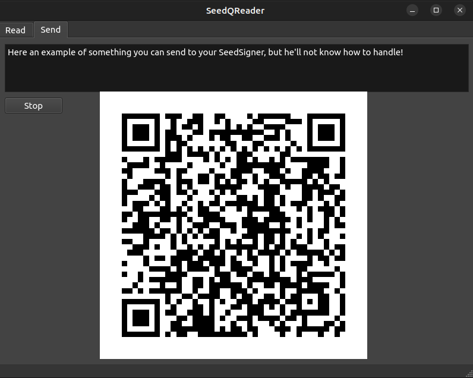

SeedQReader
---

SeedQReader is a simple tool made for communicate with airgapped Bitcoin Signer.



It actually can send/receive:
- 1 Frame QRCodes
- Multiframes QRCodes using the `Specter` format (_of_)
- Multiframes QRCodes using the `UR` format are partially supported (PSBT and Bytes)

Dependencies:
opencv might be installed

Install:
Go into this repo and run:
```
pip install -r requirements.txt 
```

Linux:
```
# For error:
# qt.qpa.plugin: From 6.5.0, xcb-cursor0 or libxcb-cursor0 is needed to load the Qt xcb platform plugin.
sudo apt install libxcb-cursor-dev
```

Run under Linux/MacOS:
```
python3 seedqreader.py
```

Run under Windows:
```
python seedqreader.py
```

If you want i build more cool tools you can support me with bitcoin:
`bc1q5pgfrt09f4vuxyryg95erge38nw94usvpe5gg0`

