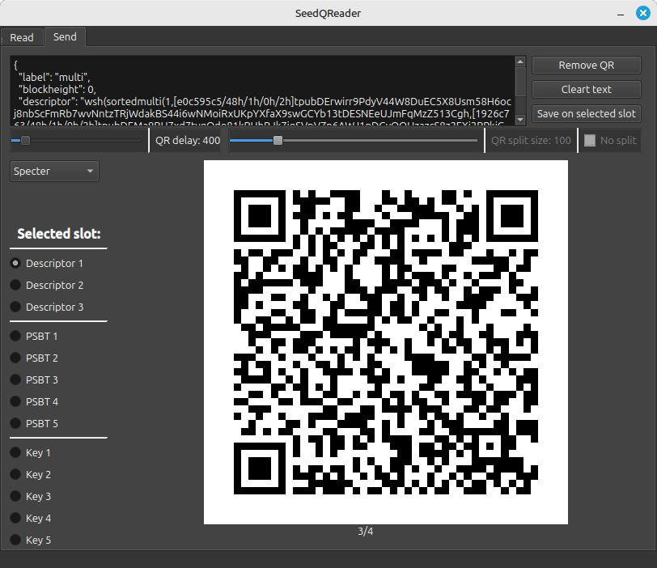

SeedQReader
---

SeedQReader is a simple tool made for communicate with airgapped Bitcoin Signer.



It actually can send/receive:
- 1 Frame QRCodes
- Multiframes QRCodes using the `Specter` format (_of_)
- Multiframes QRCodes using the `UR` format are partially supported (PSBT and Bytes)

To install, enter the repo folder and run:
```
# create environment to install dependencies
python3 -m venv .seedqrenv

# activate the environment on the current terminal
source .seedqrenv/bin/activate

# install python dependencies on this environment
pip install -r requirements.txt 
```

If you get this error, please install libxcb-cursor:
```
# qt.qpa.plugin: From 6.5.0, xcb-cursor0 or libxcb-cursor0 is needed to load the Qt xcb platform plugin.
sudo apt install libxcb-cursor0
```

Run:
```
# Linux/MacOS
python3 seedqreader.py
```

Run:
```
# Windows
python seedqreader.py
```

To build binaries:
```
python3 .ci/create-spec.py
python3 -m PyInstaller seedqreader.spec
```

Project originally created by https://github.com/pythcoiner
